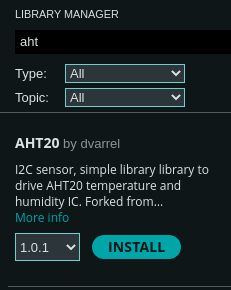

# Collecting Temperature Data

Now that we've verified sending serial data from the Arduino to our python script, let's read some real data! For this tutorial, we're using an AHT20 temperature sensor which we can read data from via the I2C protocol (pronounced "I squared C" or "I two C").

For this exercise, we won't focus too heavily on the how of talking to the sensor. If you're interested in those details, you can find them in the [datasheet](https://files.seeedstudio.com/wiki/Grove-AHT20_I2C_Industrial_Grade_Temperature_and_Humidity_Sensor/AHT20-datasheet-2020-4-16.pdf). You can usually find a link to the datasheet on the product page of the store where you bought the sensor.

The first piece of information we need is the I2C address. I2C is a bus protocol where multiple devices can be attached to two signals: the clock line and data line. The address is used so that a device knows that the data being sent on the bus is intended for it. Section 5.3 of the datasheet mentions that the I2C address is `0x38`, so we'll note that down.



Finally, in order to not focus on the low-level details, we'll pull in a library. The Arduino IDE makes this really straightforward with the Library Manager. You can find it under `Tools` -> `Manage Libraries...` or in the left-hand sidebar where it has an icon showing a bunch of books. If you type `aht` into the searchbar of the window that opens, you'll find quite a few options! I just chose the first one `AHT20 by dvarrel` and clicked the Install button. Once it's successfully installed, let's use it in our program.

```cpp
#include "Wire.h" // New library include
#include "AHT20.h" // New library include
#include <stdint.h> // New library include

const uint8_t AHT20_I2C_ADDR(0x38);
```

First we'll pull in the Arduino's I2C library with `Wire.h`, the sensor library with `AHT20.h`, and finally we'll pull in `stdint.h` which is a standard C library that defines a bunch of fixed-size types. This allows specifying that a variable is a `uint8_t` instead of an `unsigned int`. The former will always be a single byte (8 bits). The latter can change it's size based on the hardware that's being compiled to. Because every byte counts when you're working with hardware and if you send an extra byte the command you send to a sensor won't be understood at all! Define a bunch of constants for the I2C address and the two commands we need to initialize the sensor.

Since we noted the address number of the sensor from the datasheet as `0x38`, I've also added a constant above the definition of the `setup()` function.

Next, let's go ahead and start reading data from the sensor!

```cpp
// --snip--

void setup() {
    // --snip--
    Serial.println("info: booting");
    Wire.begin(); // initializes the Arduino's I2C hardware
    AHT20 aht20(AHT20_I2C_ADDR);

    bool initialized = aht20.begin();
    if (!initialized) {
        Serial.println("error: could not initialize aht20");
    } else {
        Serial.println("info: initialized sensor");
    }

    while (true) {
        while(!aht20.available()) {
            // If there's no data available, wait a little bit
            delay(10);
        }
        float temperature = aht20.getTemperature();
        Serial.print("data: ");
        Serial.println(temperature);
        delay(5000);
    }
}

void loop() {}
```

If you compile and run, you should now see something like this in your python script or in the Arduino IDE Serial Monitor:

```
info: booting
debug: sensor ready
info: initialized sensor
data: 25.72
data: 25.71
data: 25.71
data: 28.37
```

In the next chapter we'll modify our python program to parse that data from a string in the format `"data: 13.37"` into a decimal number that can be plotted or have other analysis performed on it.
